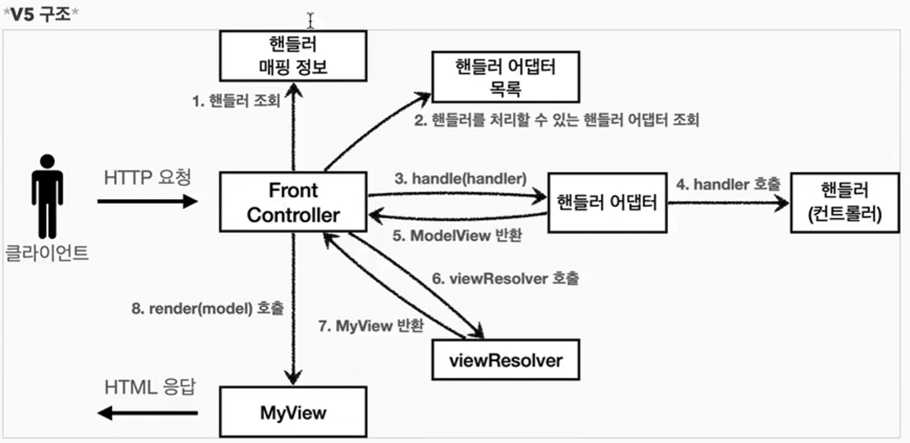

## 프로젝트 설명
### helloSpring 
- [스프링 입문- 코드로 배우는 스프링 부트, 웹 MVC, DB 접근기술](https://www.inflearn.com/course/%EC%8A%A4%ED%94%84%EB%A7%81-%EC%9E%85%EB%AC%B8-%EC%8A%A4%ED%94%84%EB%A7%81%EB%B6%80%ED%8A%B8/dashboard)
- 스프링 첫 시작으로 간단한 스프링의 전체 기능 학습
### core 
- [스프링 핵심 원리 - 기본편](https://www.inflearn.com/course/%EC%8A%A4%ED%94%84%EB%A7%81-%ED%95%B5%EC%8B%AC-%EC%9B%90%EB%A6%AC-%EA%B8%B0%EB%B3%B8%ED%8E%B8)
- Bean, Conateiner, DI, Singleton, Lifecycle (2022.12.21 ~ 2022.01.11)
### servelt
- [스프링 MVC 1편 - 백엔드 웹 개발 핵심 기술](https://www.inflearn.com/course/%EC%8A%A4%ED%94%84%EB%A7%81-mvc-1)
- Servlet을 써보며 예전 방식의 개발로 한계점 파악한 후 MVC 프레임워크(스프링)을 만들며 구조 학습 (2023.01.12 ~ 2023.01.16)

### springmvc 
- [스프링 MVC 1편 - 백엔드 웹 개발 핵심 기술](https://www.inflearn.com/course/%EC%8A%A4%ED%94%84%EB%A7%81-mvc-1)
- 로깅, 타임리프 사용해보며 HttpEntity, Http 메시지 컨버터 개념 학습과 REST API 만들기 (2023.01.16 ~ 2023.01.22)
### item-service 
- [스프링 MVC 1편 - 백엔드 웹 개발 핵심 기술](https://www.inflearn.com/course/%EC%8A%A4%ED%94%84%EB%A7%81-mvc-1)
- 지금까지 배운 개념들을 토대로 타임리프를 이용해서 CRU 기능 만들기, PGR 개념 학습 (2023.01.22 ~ 2023.01.23)
### ex1hellojpa 
- [자바 ORM 표준 JPA 프로그래밍 - 기본편](https://www.inflearn.com/course/ORM-JPA-Basic/dashboard)
- JPA 기본 개념인 영속성, 플러시, 준영속, 테이블 매핑, 컬럼 매핑, 키 매핑 학습 (2023.01.26 ~ 2023.01.30)
### jspshop
- [자바 ORM 표준 JPA 프로그래밍 - 기본편](https://www.inflearn.com/course/ORM-JPA-Basic/dashboard)
- (2023.01.30 ~ )